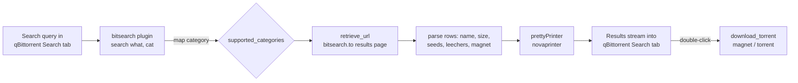

# qBittorrent BitSearch Plugin

> A qBittorrent search plugin that adds [BitSearch](https://bitsearch.to) as a source in the built-in Search tab. Single file, zero dependencies.

[](./LICENSE)
[](https://github.com/chirag127/qbittorrent-bitsearch/stargazers)
[](https://github.com/chirag127/qbittorrent-bitsearch/commits/main)
[](https://github.com/chirag127/qbittorrent-bitsearch/actions/workflows/deploy-pages.yml)
[](https://www.python.org)

## What it is / why it exists

qBittorrent ships with a Search tab, but each engine you want to search has to be added as a plugin. This is that plugin for **BitSearch.to**: a single, self-contained `.py` file (no external dependencies) that implements qBittorrent's Nova search contract so BitSearch results — name, size, seeds, leechers, and a magnet link — appear directly in the Search tab alongside your other engines. Install it once from a URL and search BitSearch without ever leaving qBittorrent.

**Live docs:** https://qbittorrent-bitsearch.oriz.in (also published at [chirag127.github.io/qbittorrent-bitsearch](https://chirag127.github.io/qbittorrent-bitsearch/) via GitHub Pages) · **Repo:** https://github.com/chirag127/qbittorrent-bitsearch

⭐ If this is useful, please star the repo — it helps others find it.

## How a search flows



## Install

### From URL (recommended)

1. Open qBittorrent.
2. **View → Search Engine** (enable the Search tab if it's hidden).
3. Click **Search plugins…** → **Install a new one**.
4. Paste this URL:

```
https://raw.githubusercontent.com/chirag127/qbittorrent-bitsearch/main/src/bitsearch.py
```

### Local file

Download `src/bitsearch.py` and use **Install a new one → Local file** in the same dialog.

## Usage

Type a query in qBittorrent's Search tab, pick a category, and select **BitSearch** (or *All plugins*). Results stream in with name, size, seeds, leechers, and a magnet link. Double-click a result to download.

### Supported categories

| qBittorrent | BitSearch mapping |
|-------------|-------------------|
| all | (all) |
| anime | anime |
| books | books |
| games | games |
| movies | movies |
| music | music |
| software | apps |
| tv | tv |

## Features

- Adds BitSearch as a native search engine inside qBittorrent's Search tab.
- Single self-contained `.py` file — no `pip install`, no external dependencies.
- Category mapping for anime, books, games, movies, music, software, and TV.
- Returns name, size, seeds, leechers, and magnet link per result.
- Implements qBittorrent's Nova search contract (`url`, `name`, `supported_categories`, `search()`, `download_torrent()`).

## Tech stack

- **Language:** Python 3.7+ (standard library only — `re`, `sys`, `urllib.parse`)
- **Runtime hooks:** qBittorrent-supplied `helpers` (`download_file`, `retrieve_url`) and `novaprinter` (`prettyPrinter`) — mocked in tests
- **Docs:** static HTML site published via GitHub Pages

## Repository structure

```
qbittorrent-bitsearch/
├── src/
│   └── bitsearch.py        # installable plugin (self-contained, as qBittorrent requires)
├── tests/
│   ├── test_bitsearch.py       # mock-based unit test
│   ├── test_bitsearch_real.py  # sample-HTML integration test
│   └── final_test.py           # comprehensive usability test
├── tools/
│   └── validate_plugin.py  # static + runtime validator
├── docs/                   # GitHub Pages site (CNAME → qbittorrent-bitsearch.oriz.in)
└── .github/workflows/      # deploy-pages.yml, megalinter.yml
```

## Development

```bash
# validate plugin contract
python tools/validate_plugin.py

# run tests
python tests/final_test.py
python tests/test_bitsearch_real.py
python -m unittest tests/test_bitsearch.py
```

The plugin implements qBittorrent's Nova search contract: a class matching the filename, with `url`, `name`, `supported_categories`, `search()`, and `download_torrent()`. It relies on qBittorrent-supplied `helpers` and `novaprinter` modules at runtime — these are mocked in tests.

## Configuration

No configuration required — it's a client-side search plugin with no env vars or secrets.

## By the same author

A standalone tool by Chirag Singhal, the author behind the [oriz](https://blog.oriz.in) family of sites. Its docs are hosted on the oriz domain (`qbittorrent-bitsearch.oriz.in`), but the plugin itself is fully standalone.

## Contributing

Issues and PRs welcome. Run `python tools/validate_plugin.py` and the tests before opening a PR.

## License

MIT © 2026 Chirag Singhal — see [LICENSE](./LICENSE).

## Author

Chirag Singhal · chirag@oriz.in

## Status

Stable. Conventional commits are the changelog.

## Disclaimer

This plugin only queries a public torrent index and surfaces its results inside qBittorrent. You are responsible for complying with your local laws and respecting copyright.
